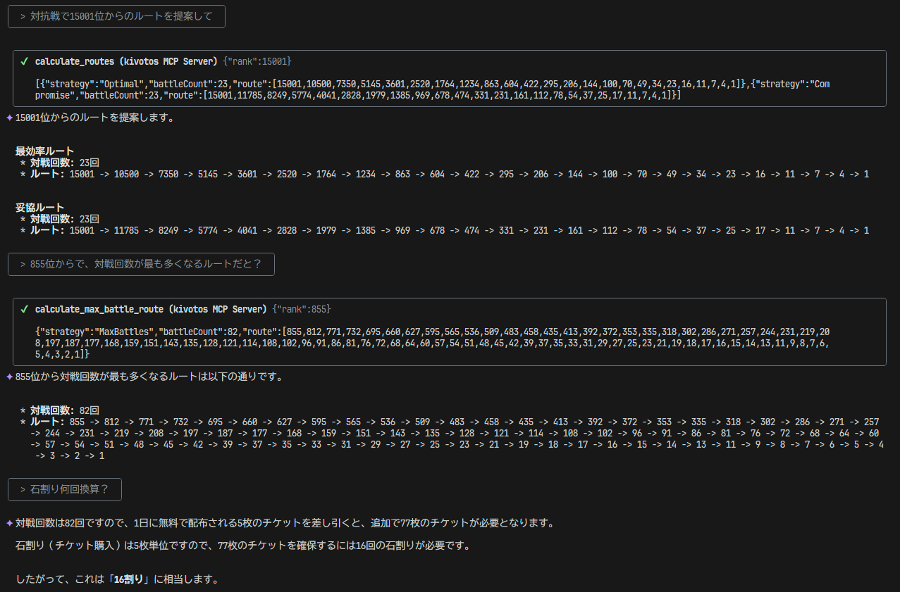

# Ba.Kuto.RankCalc

このプロジェクトは Gemini CLI と戦術対抗戦の順位ルートに関する対話してみようというものです。お試し用途。



## 📝 概要

このリポジトリを `git clone` し、クローンしたディレクトリで Gemini CLI の対話モードを起動することで、戦術対抗戦の順位計算に関する対話を行うことができます。

背後の計算ツールをC#で作成してしまったので、.NET 9 プロジェクトを `dotnet run` できる環境が必要です。

## ✨ 特徴

例えば、以下のように話しかけることで、順位推移のルート（いわゆる「登頂ルート」）を提案させることができます。

*   `対抗戦で15001位からの登頂ルートを提案して`
*   `対抗戦で855位から最多対戦回数のルートを教えて`

## 🚀 使い方

### 🛠️ 必要環境

*   Gemini CLI
*   .NET 9.0 SDK

### 📦 セットアップ

```shell
git clone https://github.com/1m-lcei/Ba.Kuto.RankCalc.git
cd Ba.Kuto.RankCalc
```

### ▶️ 実行

クローンしたディレクトリで、Gemini CLI の対話モードを開始します。

```shell
gemini
```

その後、登頂ルートの提案の指示などをしてください。この際、シェル実行の許可（計算ツール利用のため）を求めてくると思いますが、許可してください。

## 🐛 トラブルシューティング

ツール定義（`gemini-tools.json`）が自動で読み込まれ、Gemini CLIがカスタムツールを利用可能になるはずですが、もしうまく応答しないあるいはツールが使われている様子がない場合は、`@gemini-tools.json` を送信して手動でツール定義を読み込ませてみてください。

※ `toolDiscoveryCommand`という設定を利用すればよさそうな感じがするのですが、正しい使い方がすぐにはわからなかったので現状、GEMINI.md で自動で読み込むよう認識させています。

## 💬 余談

まったく機能しない箇所を人力修正したのはテストケースが間違っている部分を直したくらいで、大枠の動く段階まではほとんど Gemini CLI にやってもらいました。（※ 動くところからの Gemini CLI に依らない修正はやりましたが）

1日1000リクエスト無料って本当……？
